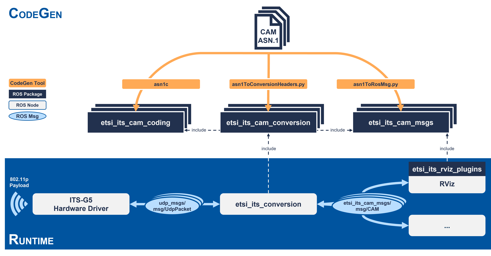

# etsi_its_messages

<p align="center">
  
  
  <a href="https://github.com/ika-rwth-aachen/etsi_its_messages/actions/workflows/codegen.yml"></a>
  <a href="https://github.com/ika-rwth-aachen/etsi_its_messages/actions/workflows/docker-ros.yml"></a>
  <a href="https://github.com/ika-rwth-aachen/etsi_its_messages/actions/workflows/doc.yml"></a>
  
  
  
</p>

**ROS / ROS 2 Support for ETSI ITS Messages for V2X Communication**


<p align="left">The <i>etsi_its_messages</i> package stack allows to use standardized ETSI ITS messages for V2X communication in ROS / ROS 2 systems. Apart from the definition of ROS message equivalents to the ETSI ITS standards, this package stack also includes a conversion node for serializing the messages to and from a UDP payload, as well as RViz plugins for visualization (ROS 2 only).</p>

All message definitions and conversion functions are automatically generated based on the [ASN.1 definitions](https://forge.etsi.org/rep/ITS/asn1) of the standardized ETSI ITS messages.

> [!IMPORTANT]  
> This repository is open-sourced and maintained by the [**Institute for Automotive Engineering (ika) at RWTH Aachen University**](https://www.ika.rwth-aachen.de/).  
> **V2X Communication** is one of many research topics within our [*Vehicle Intelligence & Automated Driving*](https://www.ika.rwth-aachen.de/en/competences/fields-of-research/vehicle-intelligence-automated-driving.html) domain.  
> If you would like to learn more about how we can support your advanced driver assistance and automated driving efforts, feel free to reach out to us!  
> :email: ***opensource@ika.rwth-aachen.de***

- [Concept](#concept)
- [Supported ETSI ITS Messages](#supported-etsi-its-messages)
- [Packages](#packages)
- [Installation](#installation)
- [Conversion Node](#conversion-node)
- [Sample Messages](#sample-messages)
- [Access Functions](#access-functions)
- [Code Generation](#code-generation)
- [V2AIX Dataset / Citation](#v2aix-dataset--citation)
- [Acknowledgements](#acknowledgements)
- [Notice](#notice)

> [!NOTE]  
> Instructions for using the *etsi_its_messages* as a ROS driver for common V2X OBU/RSU hardware such as the *Cohda Wireless MK5* are found in [`DRIVERS.md`](./DRIVERS.md).


## Concept



The core concept of the *etsi_its_messages* is to automatically generate the ROS support code based on the [ASN.1 definitions](https://forge.etsi.org/rep/ITS/asn1) of the standardized ETSI ITS messages *(CodeGen)*. The ROS support then allows ROS applications to not only natively use corresponding ETSI ITS message types, but to also exchange encoded ETSI ITS message payloads with the world outside of ROS *(Runtime)*.

A given ASN.1 definition is used to generate corresponding C-structures, ROS message definitions, as well as conversion functions between those two formats (see [Code Generation](#code-generation)).

During runtime, the `etsi_its_conversion` ROS node converts incoming UDP payloads into corresponding ROS messages and vice versa (see [Conversion Node](#conversion-node)). The ROS equivalents of the ETSI ITS messages can be used in any downstream ROS applications or visualized using the provided RViz plugins.


## Supported ETSI ITS Messages

| Status | Acronym | Name | EN Specification | TS Specification |
| --- | --- | --- | --- | --- |
| :white_check_mark: | CAM | Cooperative Awareness Message | [EN 302 637-2 V1.4.1](https://www.etsi.org/deliver/etsi_en/302600_302699/30263702/01.04.01_60/en_30263702v010401p.pdf) ([ASN.1](https://forge.etsi.org/rep/ITS/asn1/cam_en302637_2)) | [TS 103 900 V2.1.1](https://www.etsi.org/deliver/etsi_ts/103900_103999/103900/02.01.01_60/ts_103900v020101p.pdf) ([ASN.1](https://forge.etsi.org/rep/ITS/asn1/cam_ts103900)) |
| :white_check_mark: | CPM | Collective Perception Message | - | [TS 103 324 V2.1.1](https://www.etsi.org/deliver/etsi_ts/103300_103399/103324/02.01.01_60/ts_103324v020101p.pdf) ([ASN.1](https://forge.etsi.org/rep/ITS/asn1/cpm_ts103324)) |
| :white_check_mark: | DENM | Decentralized Environmental Notification Message | [EN 302 637-3 V1.3.1](https://www.etsi.org/deliver/etsi_en/302600_302699/30263703/01.03.01_60/en_30263703v010301p.pdf) ([ASN.1](https://forge.etsi.org/rep/ITS/asn1/denm_en302637_3)) | [TS 103 831 V2.2.1](https://www.etsi.org/deliver/etsi_ts/103800_103899/103831/02.02.01_60/ts_103831v020201p.pdf) ([ASN.1](https://forge.etsi.org/rep/ITS/asn1/denm_ts103831)) |
| :white_check_mark: | MAPEM | Map Extended Message | - | [TS 103 301 V2.1.1](https://www.etsi.org/deliver/etsi_ts/103300_103399/103301/02.01.01_60/ts_103301v020101p.pdf) ([ASN.1](https://forge.etsi.org/rep/ITS/asn1/is_ts103301/-/tree/v2.1.1?ref_type=tags)) |
| :white_check_mark: | SPATEM | Signal Phase and Timing Extended Message | - | [TS 103 301 V2.1.1](https://www.etsi.org/deliver/etsi_ts/103300_103399/103301/02.01.01_60/ts_103301v020101p.pdf) ([ASN.1](https://forge.etsi.org/rep/ITS/asn1/is_ts103301/-/tree/v2.1.1?ref_type=tags)) |
| :white_check_mark: | VAM | VRU Awareness Message | - | [TS 103 300-3 V2.2.1](https://www.etsi.org/deliver/etsi_ts/103300_103399/10330003/02.02.01_60/ts_10330003v020201p.pdf) ([ASN.1](https://forge.etsi.org/rep/ITS/asn1/vam-ts103300_3)) |

> [!NOTE]
> Message types that are standardized as *European Norms (EN)* are available as, e.g., `etsi_its_cam_msgs`. New message types or revisions of existing message types that are only specified in *Technical Specifications (TS)* are available as, e.g., `etsi_its_cpm_ts_msgs`.

> [!WARNING]
> **Limitations**
> - `RegionalExtension` (defined in [`ISO-TS-19091-addgrp-C-2018.asn`](https://standards.iso.org/iso/ts/19091/ed-2/en/ISO-TS-19091-addgrp-C-2018.asn)) is not covered in ROS-equivalents of MAPEM and SPATEM messages


## Packages

```bash
etsi_its_messages
├── etsi_its_coding
│   ├── etsi_its_coding         # metapackage including all coding packages
│   ├── etsi_its_cam_coding
│   ├── etsi_its_cam_ts_coding
│   ├── etsi_its_cpm_ts_coding
│   ├── etsi_its_denm_coding
│   ├── etsi_its_denm_ts_coding
│   ├── etsi_its_mapem_ts_coding
│   ├── etsi_its_spatem_ts_coding
│   └── etsi_its_vam_ts_coding
├── etsi_its_conversion
│   ├── etsi_its_conversion     # conversion node depending on all conversion packages
│   ├── etsi_its_cam_conversion
│   ├── etsi_its_cam_ts_conversion
│   ├── etsi_its_cpm_ts_conversion
│   ├── etsi_its_denm_conversion
│   ├── etsi_its_denm_ts_conversion
│   ├── etsi_its_mapem_ts_conversion
│   ├── etsi_its_primitives_conversion
│   ├── etsi_its_spatem_ts_conversion
│   └── etsi_its_vam_ts_conversion
├── etsi_its_messages           # metapackage including all others
├── etsi_its_msgs
│   ├── etsi_its_msgs           # metapackage including all msg packages
│   ├── etsi_its_cam_msgs
│   ├── etsi_its_cam_ts_msgs
│   ├── etsi_its_cpm_ts_msgs
│   ├── etsi_its_denm_msgs
│   ├── etsi_its_denm_ts_msgs
│   ├── etsi_its_mapem_ts_msgs
│   ├── etsi_its_spatem_ts_msgs
│   └── etsi_its_vam_ts_msgs
├── etsi_its_msgs_utils
└── etsi_its_rviz_plugins
```


## Installation

All *etsi_its_messages* packages are released as official ROS / ROS 2 packages and can easily be installed via a package manager.

```bash
sudo apt update
sudo apt install ros-$ROS_DISTRO-etsi-its-messages
# or single packages, e.g.
sudo apt install ros-$ROS_DISTRO-etsi-its-cam-msgs
```

If you would like to install *etsi_its_messages* from source, simply clone this repository into your ROS workspace. All dependencies that are listed in the packages' `package.xml` can be installed using [*rosdep*](http://wiki.ros.org/rosdep).

```bash
# etsi_its_messages$
rosdep install -r --ignore-src --from-paths .

# ROS 2
# workspace$
colcon build --packages-up-to etsi_its_messages --cmake-args -DCMAKE_BUILD_TYPE=Release

# ROS
# workspace$
catkin build -DCMAKE_BUILD_TYPE=Release etsi_its_messages
```

### docker-ros

The *etsi_its_messages* package stack is also available as a Docker image, containerized through [*docker-ros*](https://github.com/ika-rwth-aachen/docker-ros). Note that launching these containers starts the `etsi_its_conversion` node by default.

```bash
# ROS 2
docker run --rm ghcr.io/ika-rwth-aachen/etsi_its_messages:ros2-jazzy

# ROS
docker run --rm ghcr.io/ika-rwth-aachen/etsi_its_messages:ros-noetic
```


## Conversion Node

The `etsi_its_conversion` package provides a C++ ROS nodelet or ROS 2 component node for converting `etsi_its_msgs` ROS messages to and from [UPER-encoded](https://www.oss.com/asn1/resources/asn1-made-simple/asn1-quick-reference/packed-encoding-rules.html) [`udp_msgs/msg/UdpPacket`](https://github.com/flynneva/udp_msgs/blob/main/msg/UdpPacket.msg) payloads. This way, ETSI ITS messages cannot only be used within the ROS ecosystem, but may also be received from or sent to outside applications.

The package depends on one dedicated package for each ETSI ITS message type, e.g., `etsi_its_cam_conversion`. These packages hold header-only libraries with recursive conversion functions for each nested message type.

### Usage

The conversion node bridges all ETSI ITS message types at the same time in both directions.

```bash
# ROS 2
ros2 launch etsi_its_conversion converter.launch.py
# or
ros2 run etsi_its_conversion etsi_its_conversion_node --ros-args -p etsi_types:=[cam,cpm_ts,denm,mapem_ts,spatem_ts,vam_ts] -p has_btp_destination_port:=true -p btp_destination_port_offset:=8 -p etsi_message_payload_offset:=78

# ROS
roslaunch etsi_its_conversion converter.ros1.launch
# or
rosrun nodelet nodelet standalone etsi_its_conversion/Converter _etsi_types:=[cam,cpm_ts,denm,mapem_ts,spatem_ts,vam_ts] _has_btp_destination_port:=true _btp_destination_port_offset:=8 _etsi_message_payload_offset:=78
```

#### Subscribed Topics

| Topic | Type | Description |
| --- | --- | --- |
| `~/udp/in` | `udp_msgs/msg/UdpPacket` | UDP payload for conversion to ROS |
| `~/cam/in` | `etsi_its_cam_msgs/msg/CAM` | CAM for conversion to UDP |
| `~/cam_ts/in` | `etsi_its_cam_ts_msgs/msg/CAM` | CAM (TS) for conversion to UDP |
| `~/cpm_ts/in` | `etsi_its_cpm_ts_msgs/msg/CollectivePerceptionMessage` | CPM for conversion to UDP |
| `~/denm/in` | `etsi_its_denm_msgs/msg/DENM` | DENM for conversion to UDP |
| `~/denm_ts/in` | `etsi_its_denm_ts_msgs/msg/DENM` | DENM (TS) for conversion to UDP |
| `~/mapem_ts/in` | `etsi_its_mapem_ts_msgs/msg/MAPEM` | MAPEM (TS) for conversion to UDP |
| `~/spatem_ts/in` | `etsi_its_spatem_ts_msgs/msg/SPATEM` | SPATEM (TS) for conversion to UDP |
| `~/vam_ts/in` | `etsi_its_vam_ts_msgs/msg/VAM` | VAM (TS) for conversion to UDP |

#### Published Topics

| Topic | Type | Description |
| --- | --- | --- |
| `~/udp/out` | `udp_msgs/msg/UdpPacket` | UDP payload converted from ROS message |
| `~/cam/out` | `etsi_its_cam_msgs/msg/CAM` | CAM converted from UDP payload |
| `~/cam_ts/out` | `etsi_its_cam_ts_msgs/msg/CAM` | CAM (TS) converted from UDP payload |
| `~/cpm_ts/out` | `etsi_its_cpm_ts_msgs/msg/CollectivePerceptionMessage` | CPM converted from UDP payload |
| `~/denm/out` | `etsi_its_denm_msgs/msg/DENM` | DENM converted from UDP payload |
| `~/denm_ts/out` | `etsi_its_denm_ts_msgs/msg/DENM` | DENM (TS) converted from UDP payload |
| `~/mapem_ts/out` | `etsi_its_mapem_ts_msgs/msg/MAPEM` | MAPEM (TS) converted from UDP payload |
| `~/spatem_ts/out` | `etsi_its_spatem_ts_msgs/msg/SPATEM` | SPATEM (TS) converted from UDP payload |
| `~/vam_ts/out` | `etsi_its_vam_ts_msgs/msg/VAM` | VAM (TS) converted from UDP payload |

#### Parameters

| Parameter | Type | Description | Options |
| --- | --- | --- | --- |
| `has_btp_destination_port` | `bool` | whether incoming/outgoing UDP messages include a [2-byte BTP destination port](https://www.etsi.org/deliver/etsi_en/302600_302699/3026360501/02.01.00_20/en_3026360501v020100a.pdf) |
| `btp_destination_port_offset` | `int` | number of bytes before an optional 2-byte BTP destination port, see `has_btp_destination_port` (always `0` in outgoing UDP payload) |
| `etsi_message_payload_offset` | `int` | number of bytes before actual ETSI message payload (always `0` or `4` (if `has_btp_destination_port`) in outgoing UDP payload) |
| `ros2udp_etsi_types` | `string[]` | list of ETSI types to convert from `etsi_its_msgs` to `udp_msgs` (defaults to all norms and specifications of all possible ETSI types) | `cam`, `cam_ts`, `cpm_ts`, `denm`, `denm_ts`, `mapem_ts`, `spatem_ts`, `vam_ts` |
| `udp2ros_etsi_types` | `string[]` | list of ETSI types to convert from `udp_msgs` to `etsi_its_msgs` (defaults only to the norm or specification of all possible ETSI types)  | `cam`, `cam_ts`, `cpm_ts`, `denm`, `denm_ts`, `mapem_ts`, `spatem_ts`, `vam_ts` |
| `subscriber_queue_size` | `int` | queue size for incoming ROS messages |
| `publisher_queue_size` | `int` | queue size for outgoing ROS messages |
| `check_constraints_before_encoding` | `bool` | whether an asn constraint check should be performed before encoding using asn1c's `asn_check_constraints` function (setting to `true` could lead to segmentation faults because of infinite recursion; [known asn1c issue](https://github.com/vlm/asn1c/issues/410)) |


## Sample Messages

The `etsi_its_msgs_utils` package contains simple ROS 2 nodes for publishing sample ROS 2 messages of the supported ETSI ITS message types, see [`./etsi_its_msgs_utils/samples/`](./etsi_its_msgs_utils/samples/). For example, publish a sample CPM by running the following.

```bash
# ROS 2 only
ros2 run etsi_its_msgs_utils publish_cpm_ts.py
```

You can then visualize the CPM in RViz with the provided demo configuration.

```bash
# ROS 2 only
ros2 launch etsi_its_rviz_plugins demo.launch.py
```

And finally, run the [Conversion Node](#conversion-node) to convert ROS 2 messages to binary payloads.

```bash
# ROS 2 only
ros2 run etsi_its_conversion etsi_its_conversion_node \
    --ros-args \
        -r __node:=etsi_its_conversion \
        -r /etsi_its_conversion/udp/out:=/etsi_its_conversion/udp/in \
        -p has_btp_destination_port:=true \
        -p btp_destination_port_offset:=0 \
        -p etsi_message_payload_offset:=4
```


## Access Functions

The `etsi_its_msgs_utils` package contains header-only libraries providing helpful access functions for modifying the deeply nested ROS messages equivalents of the ETSI ITS messages. All access functions are [documented here](https://ika-rwth-aachen.github.io/etsi_its_messages/).

```cpp
#include <etsi_its_cam_msgs/msg/cam.hpp>
#include <etsi_its_msgs_utils/cam_access.hpp> // access functions

// ...

double speed = 10.0; // vehicle speed in m/s
etsi_its_cam_msgs::msg::CAM cam;
etsi_its_cam_msgs::access::setSpeed(cam, speed);
// instead of
cam.cam.cam_parameters.high_frequency_container.basic_vehicle_container_high_frequency.speed.speed_value.value = (uint16_t)(speed * 1e2);

// ...
```


## Code Generation

> [!NOTE]
> This section is only relevant if you would like to (re-)run the code generation for ROS support based on ASN.1 definitions. If you only wish to use the supported message types in ROS, see [Installation](#installation) and [Conversion Node](#conversion-node).

A given ASN.1 definition is used to generate corresponding C-structures, ROS message definitions, as well as conversion functions between those two formats. The raw ASN.1 definitions of the supported message types are included as Git submodules in the [`asn1/raw` subdirectory](./asn1/raw/). Make sure to clone recursively or initialize the submodules after cloning (`git submodule update --init --recursive`). Note that some of these definitions need to be downloaded and patched before code generation by running [`./asn1/external/download.sh`](./asn1/external/download.sh) and [`./asn1/patches/patch.sh`](./asn1/patches/patch.sh).

The [currently used code generation tool is Python-based](./utils/codegen/codegen-py/). There is also an [alternative Rust-based implementation](./utils/codegen/codegen-rust/) that is currently not maintained anymore (added in #17, replaced again in #28, #48), but kept for reference.

If you would like to re-run the generation of supported message types, we recommend to use the [*VS Code* debugging configurations](https://code.visualstudio.com/docs/editor/debugging) pre-configured in [`.vscode/launch.json`](./.vscode/launch.json). All script calls defined there can obviously also run outside of *VS Code*. Note that *Python* and *Docker* are required for code generation.

If you would like to run the generation for new message types or message type versions, call the scripts defined in [`.vscode/launch.json`](./.vscode/launch.json) on your custom ASN.1 definitions.


## V2AIX Dataset / Citation

The *etsi_its_messages* package stack was created and used in order to record the [V2AIX Dataset](https://v2aix.ika.rwth-aachen.de). Please consider citing our paper if you are also using the package stack in your own research.

> **V2AIX: A Multi-Modal Real-World Dataset of ETSI ITS V2X Messages in Public Road Traffic**  
> *([arXiv](https://arxiv.org/abs/2403.10221), [ResearchGate](https://www.researchgate.net/publication/378971373_V2AIX_A_Multi-Modal_Real-World_Dataset_of_ETSI_ITS_V2X_Messages_in_Public_Road_Traffic))*  
>
> [Guido Küppers](https://github.com/gkueppers), [Jean-Pierre Busch](https://github.com/jpbusch) and [Lennart Reiher](https://github.com/lreiher), [Lutz Eckstein](https://www.ika.rwth-aachen.de/en/institute/team/univ-prof-dr-ing-lutz-eckstein.html)  
> [Institute for Automotive Engineering (ika), RWTH Aachen University](https://www.ika.rwth-aachen.de/en/)
>
> <sup>*Abstract* – Connectivity is a main driver for the ongoing megatrend of automated mobility: future Cooperative Intelligent Transport Systems (C-ITS) will connect road vehicles, traffic signals, roadside infrastructure, and even vulnerable road users, sharing data and compute for safer, more efficient, and more comfortable mobility. In terms of communication technology for realizing such vehicle-to-everything (V2X) communication, the WLAN-based peer-to-peer approach (IEEE 802.11p, ITS-G5 in Europe) competes with C-V2X based on cellular technologies (4G and beyond). Irrespective of the underlying communication standard, common message interfaces are crucial for a common understanding between vehicles, especially from different manufacturers. Targeting this issue, the European Telecommunications Standards Institute (ETSI) has been standardizing V2X message formats such as the Cooperative Awareness Message (CAM). In this work, we present V2AIX, a multi-modal real-world dataset of ETSI ITS messages gathered in public road traffic, the first of its kind. Collected in measurement drives and with stationary infrastructure, we have recorded more than 285 000 V2X messages from more than 2380 vehicles and roadside units in public road traffic. Alongside a first analysis of the dataset, we present a way of integrating ETSI ITS V2X messages into the Robot Operating System (ROS). This enables researchers to not only thoroughly analyze real-world V2X data, but to also study and implement standardized V2X messages in ROS-based automated driving applications. The full dataset is publicly available for non-commercial use at https://v2aix.ika.rwth-aachen.de.</sup>


## Acknowledgements

This work is accomplished within the projects AIthena, 6GEM and AUTOtech.*agil*. We acknowledge the financial support for the projects by
- the *European Union’s Horizon Europe Research and Innovation Programme* :eu: under Grant Agreement No 101076754 for AIthena,
- and the *Federal Ministry of Education and Research of Germany (BMBF)* :de: for 6GEM (FKZ 16KISK036K) and AUTOtech.*agil* (FKZ 01IS22088A).


## Notice

This repository is not endorsed by or otherwise affiliated with [ETSI](https://www.etsi.org).

This repository uses the following software. For full license details, please refer to the specific license files of the respective software.

- [asn1c](https://github.com/vlm/asn1c)
    ```
    BSD 2-Clause License
    Copyright (c) 2003-2017  Lev Walkin <vlm@lionet.info> and contributors.
    All rights reserved.
    ```
- [asn1tools](https://github.com/eerimoq/asn1tools)
    ```
    MIT License
    Copyright (c) 2017-2019 Erik Moqvist
    ```
- [ETSI ITS ASN1](https://forge.etsi.org/rep/ITS/asn1)
    ```
    BSD 3-Clause License
    Copyright (c) ETSI
    ```
- [GeographicLib](https://github.com/geographiclib/geographiclib)
    ```
    MIT License
    Copyright (c) 2008-2023, Charles Karney
    ```
- [rasn](https://github.com/librasn/rasn)
    ```
    MIT License
    Copyright (c) 2016 Erin Power
    ```
- [ROS](https://www.ros.org/)
    ```
    BSD 3-Clause License
    All rights reserved.
    ```
- [ROS 2](https://www.ros2.org/)
    ```
    Apache 2.0 License
    All rights reserved.
    ```
